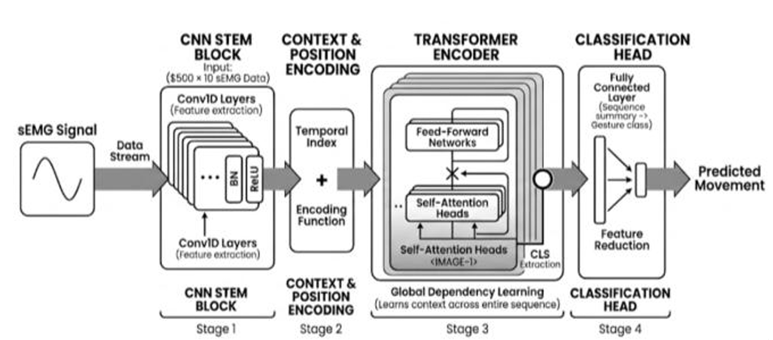
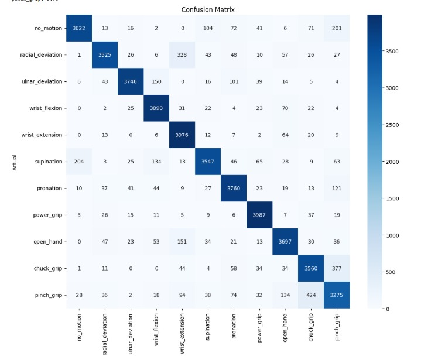

# AI-Driven Hand Prosthetic Control
### CNN-Transformer Architecture for sEMG Gesture Recognition with Real-Time Unity Simulation

> **Biomedical Engineering — Rehabilitation**  
> Faculty of Engineering & Technology, Egypt  
> *Rawan Ahmed · Muhammed Salah · Shaimaa Kamel · Bassant Rabie . Ahmed AbdelElaal*

---

<!-- 
  📸 SUGGESTED IMAGE: Place a banner/hero image here showing either:
    - A collage of the Unity simulated hand alongside the sEMG armband
    - Or a screenshot of the real-time simulation in action
  Example: 
-->

[](https://python.org)
[](https://pytorch.org)
[](https://unity.com)
[](LICENSE)

---

## 📋 Table of Contents

- [Overview](#-overview)
- [Key Results](#-key-results)
- [Architecture](#-architecture)
- [Dataset](#-dataset)
- [Repository Structure](#-repository-structure)
- [Getting Started](#-getting-started)
- [Unity Integration](#-unity-integration)
- [Results](#-results)
- [Limitations & Future Work](#-limitations--future-work)
- [Citation](#-citation)
- [Team](#-team)

---

## 🧠 Overview

This project presents a **myoelectric prosthetic hand control system** that interprets surface electromyography (sEMG) signals to recognize **11 distinct hand and wrist gestures** in real time. Predicted gestures are streamed to a **Unity-based 3D prosthetic hand simulation** via kinematic bone mapping.

We propose a **hybrid CNN-Transformer architecture** trained on the publicly available [3DC Dataset](https://github.com/LibEMG/3DCDataset), improving upon the ADANN baseline with a 500 ms sliding window and channel-specific normalization.

<!-- 
  📸 SUGGESTED IMAGE: System overview diagram showing the full pipeline:
    EMG Armband → Preprocessing → CNN-Transformer Model → Unity Simulation
  Example: 
-->

---

## 🏆 Key Results

| Model | Window Size | Mean Accuracy |
|---|---|---|
| ADANN (Baseline) | 151 ms | 84.09% |
| **CNN-Transformer (Ours)** | 151 ms | 85.29% |
| **CNN-Transformer (Ours)** | **500 ms** | **89.57% ✅** |

> Our model achieves **+5.48 percentage points** over the ADANN baseline, with the largest gains in Pronation (+16.62 pp) and Pinch Grip (+8.82 pp).

---

## 🏗 Architecture

<!-- 
  📸 SUGGESTED IMAGE: The CNN-Transformer architecture diagram (Figure II from the paper)
  Example: 
-->

The model is composed of four main stages:


### 1. CNN Stem Block
Parallel 1-D convolutional stems process multi-channel sEMG input. Each stem applies `Conv1D → BatchNorm → ReLU` to extract local spectral and temporal features. Dropout (`p = 0.35`) regularizes training.

### 2. Context & Positional Encoding
A learnable **CLS token** is prepended to the feature sequence. **Sinusoidal positional encodings** are added to preserve temporal ordering across the window.

### 3. Transformer Encoder
Two Transformer encoder blocks, each with:
- **4 multi-head self-attention heads**
- Feed-forward sub-layer
- Embedding dimension: **64**

This stage captures global temporal dependencies and cross-channel muscle interactions that 1-D convolutions alone cannot model.

### 4. Classification Head
The CLS token output passes through feature reduction layers into a **fully connected softmax head** producing an 11-class gesture probability vector. Trained with cross-entropy loss and the Adam optimizer.

---

## 📊 Dataset

We use the publicly available **3DC Dataset** ([Cote-Allard et al., 2020](https://doi.org/10.3389/fbioe.2020.00158)):

| Property | Details |
|---|---|
| Participants | 22 able-bodied subjects |
| Sensor | Wireless 10-channel dry-electrode sEMG armband |
| Sampling Rate | 1,000 Hz |
| Gestures | 11 (see below) |
| Training Set | 4 × 55-second cycles |
| Test Set | 4 additional cycles (after 5-min rest) |

### Gesture Classes

<!-- 
  📸 SUGGESTED IMAGE: The 11 gesture image grid (Figure I from the paper)
  Example: 
-->

| # | Gesture | # | Gesture |
|---|---|---|---|
| 0 | Neutral | 6 | Pronation |
| 1 | Radial Deviation | 7 | Power Grip |
| 2 | Wrist Flexion | 8 | Open Hand |
| 3 | Ulnar Deviation | 9 | Chuck Grip |
| 4 | Wrist Extension | 10 | Pinch Grip |
| 5 | Supination | | |

### Preprocessing

- **Sliding Window:** Two strategies evaluated — 151 ms (baseline) and 500 ms (extended)
- **Overlap:** 100 ms for both strategies
- **Normalization:** Channel-specific z-score normalization computed from the training split


## 🎮 Unity Integration

<!-- 
  📸 SUGGESTED IMAGE: Screenshot of the Unity simulated hand performing a gesture (Figure IV from the paper)
  Example: 
-->

The real-time inference pipeline connects to a Unity scene containing a 3D articulated prosthetic hand model. The full pipeline runs as follows:

```
[sEMG Armband]
      ↓
[Temporal Windowing + Channel Normalization]
      ↓
[CNN-Transformer Inference]
      ↓
[Stability Verification: 3 consecutive consistent predictions]
      ↓
[Send confirmed gesture label → Unity via socket]
      ↓
[Kinematic Bone Mapping → Finger Joint Angles]
```

<!-- 
  📸 SUGGESTED IMAGE: The Unity Integration Pipeline flowchart (Figure III from the paper)
  Example: 
-->

### Unity Setup

1. Open `unity/ProstheticHand.unity` in **Unity 2022.3 LTS**
2. Attach `HandMotionManager.cs` to the Hand GameObject
3. Configure the socket port to match your inference script (default: `5005`)
4. Press **Play** to start the simulation
5. Run `server.py` to begin streaming gestures

> The stability verifier requires **3 consecutive consistent predictions** before confirming a gesture, suppressing transient misclassifications. Unstable predictions restart the verification counter.

---

## 📈 Results

### Confusion Matrix




### Per-Gesture Accuracy

| Gesture | ADANN (WS 151) | CNN-Trans (WS 151) | CNN-Trans (WS 500) |
|---|---|---|---|
| Neutral | 87.0% | 88.1% | 87.32% |
| Radial Deviation | 81.0% | 82.0% | 86.04% |
| Ulnar Deviation | 93.0% | 93.7% | 90.83% |
| Wrist Flexion | 90.0% | 91.9% | **95.04%** |
| Wrist Extension | 91.0% | 93.6% | **96.76%** |
| Supination | 80.0% | 81.2% | 85.74% |
| Pronation | 75.0% | 81.1% | **91.62%** |
| Power Grip | 93.0% | 82.2% | **96.65%** |
| Open Hand | 87.0% | 87.6% | 90.06% |
| Chuck Grip | 78.0% | 82.6% | 86.34% |
| Pinch Grip | 70.0% | 64.2% | 78.82% |
| **Average** | **84.09%** | **85.29%** | **89.57%** |

<!-- 
  📸 SUGGESTED IMAGE: Bar chart comparing per-gesture accuracy across the 3 models
  Example: 
-->

---

## ⚠️ Limitations & Future Work

**Current Limitations:**
- Data collected in controlled lab settings — real-world factors (sweat, fatigue, electrode shift) were not evaluated
- No channel selection/optimization (e.g., mRMR) to reduce hardware and computational overhead
- Evaluated under intra-subject conditions only; cross-subject domain adaptation not yet applied

**Future Work:**
- Real-time latency optimization for the 500 ms window
- Amputee-specific fine-tuning
- High-density electrode integration
- Cross-subject domain adaptation strategies


**Key Reference:**
> Cote-Allard, U., et al. (2020). "Interpreting Deep Learning Features for Myoelectric Control: A Comparison With Handcrafted Features." *Frontiers in Bioengineering and Biotechnology*, 8, 158.


---

<div align="center">
  <sub>Faculty of Engineering, Egypt · Biomedical Engineering · 2025</sub>
</div>